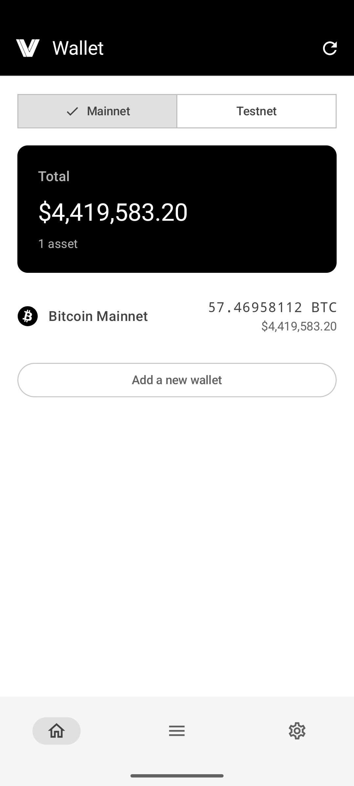
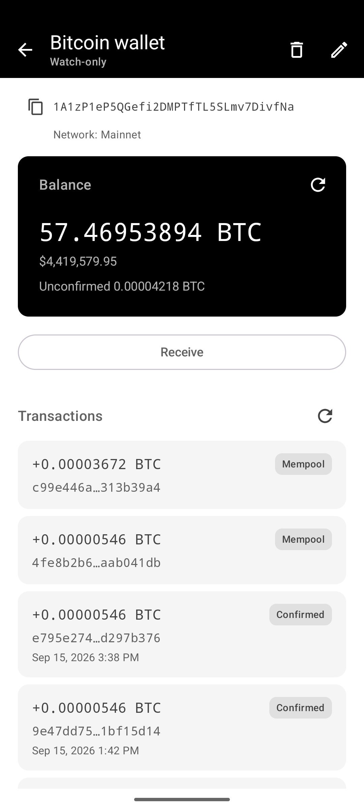

# AndroidCryptoWallet

[](https://github.com/GunnarKarlsson/AndroidCryptoWallet/actions/workflows/ci.yml)
[](LICENSE)
[](https://kotlinlang.org/)
[](app/build.gradle.kts)
[](app/build.gradle.kts)

AndroidCryptoWallet is a non-custodial Android wallet for Bitcoin and several EVM chains. You create or restore a wallet from a BIP-39 seed; keys stay on the device. Bitcoin uses native SegWit. Ethereum, BSC, Polygon, Arbitrum, Base, Optimism, and Avalanche share one EVM stack that is easy to extend with another curated chain.

> **Disclaimer.** This software has not been audited. Use testnets first. Never share a seed phrase. You are responsible for funds you put on mainnet.

## Screenshots

<p>


</p>

## Features

- Non-custodial; seed encrypted with Android Keystore + EncryptedSharedPreferences
- Bitcoin native SegWit (BIP-84), testnet4 + mainnet
- EVM: Ethereum, BSC, Polygon, Arbitrum, Base, Optimism, Avalanche
- Compose + Hilt + Room + BDK + Web3j

## Non-features

- Single-address Bitcoin model (change returns to receive index 0)
- No ERC-20 / NFT portfolio yet
- No hardware wallets
- Not audited
- Not on Play yet

## Security model

Keys never leave the device. The secret at rest is the **seed** (BIP-39 mnemonic plus optional passphrase), stored in `EncryptedSharedPreferences` (`bitcoin_mnemonic` / `ethereum_mnemonic`) under an Android Keystore `MasterKey` (AES-256). Android backup is disabled (`allowBackup="false"`). `backup_rules.xml` and `data_extraction_rules.xml` also exclude those prefs files, Room (`wallet.db`), and the rest of app data so cloud backup and device-to-device transfer cannot copy the seed. Public data (receive address, network, derivation index) lives in Room. Secrets never go in Room, DataStore, or logs.

Signing does not persist private keys. On send, the app decrypts the seed, rebuilds keys in memory, signs, and drops the seed. Watch-only Bitcoin wallets have no seed and cannot send. Logcat does not record the seed, passphrase, or signed raw transaction hex. OkHttp BODY logging is not used; the logging interceptor is `debugImplementation` only.

HTTPS is required (`usesCleartextTraffic="false"` plus a [network security config](app/src/main/res/xml/network_security_config.xml)). RPC and explorer endpoints are **not authenticated** and are **not certificate-pinned** — Settings lets you point each provider at your own URL. A malicious or compromised node can lie about balances, fees, and history, or refuse to broadcast; it never receives the seed. Prefer a node you run or trust, especially on mainnet.

This project has **not** been audited. Report vulnerabilities **privately** — see [SECURITY.md](SECURITY.md). Do not open a public GitHub issue for security findings.

## Network security

The app talks to third-party HTTPS hosts for chain data and USD prices. Defaults (overridable in Settings, except CoinGecko):

| Purpose | Default hosts |
|---------|----------------|
| Bitcoin (Esplora) | `mempool.space` (`/api/`, `/testnet4/api/`) |
| USD prices | `api.coingecko.com` |
| Ethereum RPC | `ethereum.publicnode.com`, `ethereum-sepolia-rpc.publicnode.com` |
| Ethereum explorer | `eth.blockscout.com`, `eth-sepolia.blockscout.com` |
| BSC RPC | `bsc-dataseed.bnbchain.org`, `data-seed-prebsc-1-s1.bnbchain.org` |
| BSC explorer | `api.bscscan.com`, `api-testnet.bscscan.com` |
| Polygon RPC | `polygon-bor-rpc.publicnode.com`, `polygon-amoy-bor-rpc.publicnode.com` |
| Polygon explorer | `api.polygonscan.com`, `api-amoy.polygonscan.com` |
| Arbitrum RPC | `arb1.arbitrum.io`, `sepolia-rollup.arbitrum.io` |
| Arbitrum explorer | `api.arbiscan.io`, `api-sepolia.arbiscan.io` |
| Base RPC | `mainnet.base.org`, `sepolia.base.org` |
| Base explorer | `api.basescan.org`, `api-sepolia.basescan.org` |
| Optimism RPC | `mainnet.optimism.io`, `sepolia.optimism.io` |
| Optimism explorer | `api-optimistic.etherscan.io`, `api-sepolia-optimistic.etherscan.io` |
| Avalanche RPC | `api.avax.network`, `api.avax-test.network` |
| Avalanche explorer | `api.snowtrace.io`, `api-testnet.snowtrace.io` |

Cleartext `http://` is blocked. Custom provider URLs in Settings must be `https://`. There is no API key on these public endpoints; operators can see the addresses you query.

## Supported chains

**Bitcoin** — native SegWit on mainnet and testnet4, including watch-only addresses.

**EVM** — one wallet UI per family; pick the network from a dropdown. New EVM families are curated by the developer (users cannot add arbitrary RPCs yet).

| Family | Mainnet | Testnet |
|--------|---------|---------|
| Ethereum | `1` | Sepolia `11155111` |
| BSC | `56` | BSC Testnet `97` |
| Polygon | `137` | Amoy `80002` |
| Arbitrum | `42161` | Sepolia `421614` |
| Base | `8453` | Sepolia `84532` |
| Optimism | `10` | Sepolia `11155420` |
| Avalanche | `43114` | Fuji `43113` |

## Build from source

1. Copy `local.properties.example` to `local.properties` (Android Studio also creates this with `sdk.dir`).
2. Optionally set mock watch-only addresses (`MOCK_BITCOIN_WALLET_TESTNET4` / `MOCK_BITCOIN_WALLET_MAINNET`) to any bitcoin address you want to view in the wallet lists and tx lists.
3. Open the project in Android Studio and run the `debug` build (Bitcoin testnet4), or from the repo root:

```bash
./gradlew :app:assembleDebug
```

See [CONTRIBUTING.md](CONTRIBUTING.md) for tests, PR expectations, and emulator-data warnings. Do not uninstall the debug app or run instrumented tests against an emulator that already has wallets — those flows wipe Room and the encrypted mnemonic store.

## Architecture

Compose UI, Hilt, Room, [BDK](https://github.com/bitcoindevkit) (Bitcoin), and [Web3j](https://docs.web3j.io/) (EVM). Bitcoin chain data comes from [mempool.space](https://mempool.space). EVM balance/send uses JSON-RPC; tx history uses Blockscout or Etherscan-compatible explorers.

<details>
<summary>Bitcoin: keys, seed, and signing (BIP-39 / BIP-32 / BIP-84)</summary>

Supported BIPs:

- **BIP-39** — 12-word English mnemonic, optional passphrase
- **BIP-32** — HD derivation (via BDK)
- **BIP-84** — Native SegWit (`bc1q` / `tb1q`) at account `m/84'/0'/0'` (mainnet) or `m/84'/1'/0'` (testnet4)

This is an HD wallet. The encrypted secret at rest is the **seed** (mnemonic + optional passphrase), not a per-address WIF or xprv. Public data (receive address, network, derivation index) lives in Room. Secrets never go in Room, DataStore, or logs.

At rest, the seed is stored in `EncryptedSharedPreferences` keyed by wallet id, with an Android Keystore `MasterKey` (AES-256). Backup is disabled (`allowBackup="false"`).

Signing does not persist private keys. On send, the app decrypts the seed, BDK rebuilds an in-memory BIP-84 wallet, derives the key for the receive address, signs the PSBT, and drops the seed from the call stack. Watch-only wallets have no seed and cannot send.

</details>

<details>
<summary>Bitcoin: balance and UTXOs</summary>

The wallet is a **single-address** model: balance, history, and coins all belong to the BIP-84 receive address (external index 0). Change from a send is paid back to that same address, so it stays visible and spendable on the next send.

The amount shown on wallet details is the address chain balance from the RPC provider (confirmed received minus confirmed spent). Incoming or outgoing mempool amounts are shown separately as unconfirmed; they are **not** added to the spendable total.

Spending does not use that cached display figure. Right before building a transaction the app fetches UTXOs for the receive address and keeps only **confirmed** outputs (`status.confirmed == true`). Unconfirmed coins cannot be selected. Those confirmed UTXOs are the spendable balance: their satoshi values are what BDK coin-selects against the send amount plus fee. Fee is `sum(inputs) − sum(outputs)` at the chosen sat/vB rate; if confirmed UTXOs cannot cover amount plus fee, send fails with insufficient funds.

</details>

<details>
<summary>Bitcoin RPC provider</summary>

Chain data comes from [mempool.space](https://mempool.space) (Esplora-compatible HTTP: address balance, history, UTXOs, and broadcast). Mainnet uses `https://mempool.space/api/`; testnet4 uses `https://mempool.space/testnet4/api/`. No API key is required for low request quantities.

To add another chain client later:

1. Implement every method on `BitcoinRemoteDataSource` (balance, transactions, UTXOs, transaction hex, broadcast, tip height). Do not ship a partial client.
2. Add a `@Binds` (or `@Provides`) of that type in Hilt and swap the mempool.space bind in `DataBindsModule`.
3. Put provider-specific URLs and keys in `local.properties` → BuildConfig, never in git.
4. Reuse the existing `MsApiFactory` pattern (per-network Retrofit cache) if the API is HTTP.

</details>

<details>
<summary>EVM stack</summary>

AndroidCryptoWallet supports easily adding new EVM chains, but curated by the developer. In the future we might add the feature for the user to add chains.

Each **family** (Ethereum, BSC, …) is a chain-select entry. Users pick a **network** inside that family (Sepolia, BSC Testnet, …) from the dropdown. You do not add new screen packages or repositories. All families share the same wallet screens and backend (JSON-RPC, signing, tx history). BSC is the reference implementation.

What you get for free:

- JSON-RPC balance/send and EIP-1559 signing (`JsonRpcEvmRemoteDataSource`, `Web3jEvmKeyEngine`)
- BIP-44 coin type `60'` (MetaMask-compatible addresses)
- Room `ethereum_wallet` / tx cache and encrypted `ethereum_mnemonic` prefs (names unchanged)
- Shared screens under `app/src/main/java/.../ui/evm/**`, filtered by `EvmFamily`
- Receive QR: EIP-681 `ethereum:address@chainId`
- Amount labels from `network.nativeSymbol`

</details>

## Adding a chain

How to add a curated EVM family. All families share the same wallet screens and backend. BSC is the reference implementation.

### Checklist

#### 1. Domain — `EvmFamily` + `EvmNetwork`

| Task | File |
|------|------|
| Add enum value | `app/src/main/java/network/bahn/androidcryptowallet/domain/model/EvmFamily.kt` |
| Add networks (testnet + mainnet typical) | `app/src/main/java/network/bahn/androidcryptowallet/domain/model/EvmNetwork.kt` |

Each `EvmNetwork` needs: `family`, `label` (dropdown), `chainId`, `nativeSymbol`. `EvmNetwork.networksFor(family)` filters automatically.

Wallets store `network` as the enum name (`SEPOLIA`, `BSC_TESTNET`, …). New constants are **additive only** — no migration. Do **not** rename existing enum names.

Tests: extend `app/src/test/java/.../domain/model/EvmNetworkTest.kt`.

#### 2. Catalog — RPC + explorer

| Task | File |
|------|------|
| RPC URL per network | `app/src/main/java/network/bahn/androidcryptowallet/data/repository/DefaultProviderCatalog.kt` |
| Explorer URL + kind per network | same |

```kotlin
rpcUrls = mapOf(EvmNetwork.NEW_TESTNET to "https://…", …)
explorerEndpoints = mapOf(
    EvmNetwork.NEW_TESTNET to EvmExplorerEndpoint(
        baseUrl = "https://…",
        kind = EvmExplorerKind.BLOCKSCOUT, // or ETHERSCAN
    ),
)
```

Tx history adapters (picked automatically by `RoutingEvmTransactionRemoteDataSource`):

| Kind | API | Class |
|------|-----|-------|
| `BLOCKSCOUT` | Blockscout REST v2 | `BlockscoutEvmTransactionRemoteDataSource` |
| `ETHERSCAN` | Etherscan-compatible `txlist` | `EtherscanEvmTransactionRemoteDataSource` |

If the explorer is neither format, add a new `EvmExplorerKind`, adapter, and routing branch.

Tests: extend `app/src/test/java/.../data/remote/evm/EvmChainCatalogTest.kt`.

#### 3. Chain select — label, icon, strings

| Task | File |
|------|------|
| Chain-select enum + order | `app/src/main/java/.../ui/chain/SupportedChain.kt` |
| Label + icon on chain select | `app/src/main/java/.../ui/chain/ChainSelectScreen.kt` |
| List title, default wallet name, clipboard label | `app/src/main/java/.../ui/chain/EvmFamilyUi.kt` |
| `SupportedChain` → `EvmFamily` | `EvmFamilyUi.kt` → `toEvmFamily()` |

Add to `app/src/main/res/values/strings.xml` (mirror Ethereum/BSC):

| Resource | Example (BSC) |
|----------|-----------------|
| `chain_*` | `chain_bsc` |
| `*_wallets_title` | `bsc_wallets_title` |
| `*_wallet_list_item_label` | `bsc_wallet_list_item_label` |
| `receive_clipboard_label_*` | `receive_clipboard_label_bsc` |

Add `app/src/main/res/drawable/ic_chain_<family>.xml`.

#### 4. Navigation

In `app/src/main/java/.../ui/navigation/WalletNavHost.kt`:

```kotlin
SupportedChain.NEW_FAMILY ->
    navController.navigate(EvmWalletListRoute(EvmFamily.NEW_FAMILY))
```

Create/restore/details/send/receive/edit reuse the existing EVM graph — no new route types.

#### 5. Default network

In `app/src/main/java/.../data/local/prefs/SelectedEvmNetworkDataStore.kt` → `defaultNetwork()`: set the family’s testnet (e.g. ETH → `SEPOLIA`, BSC → `BSC_TESTNET`).

#### 6. Verify

```bash
./gradlew :app:testDebugUnitTest
```

Manual smoke (do not clear emulator app data):

1. Chain select → new family → dropdown shows only that family’s networks.
2. Create wallet on testnet → receive QR ends with `@<chainId>`.
3. Send native on testnet.
4. Details → tx history loads (or empty, no crash).
5. Other families unchanged.

### Do not

- Add new screen packages — reuse `ui/evm/**`
- Merge EVM with the Bitcoin stack
- Rename/drop `ethereum_*` tables or `ethereum_mnemonic` prefs
- Run destructive migrations or reinstall/clear app data to test
- Add ERC-20 / BEP-20 tokens in the same change

### BSC reference — files touched

| Area | Files |
|------|-------|
| Domain | `EvmFamily.kt`, `EvmNetwork.kt` |
| Catalog | `DefaultProviderCatalog.kt` |
| Tx history | `EtherscanTx.kt`, `EtherscanEvmTransactionRemoteDataSource.kt`, `RoutingEvmTransactionRemoteDataSource.kt` |
| Chain select | `SupportedChain.kt`, `ChainSelectScreen.kt`, `EvmFamilyUi.kt`, `strings.xml`, `ic_chain_bsc.xml` |
| Nav | `WalletNavHost.kt` |
| Defaults | `SelectedEvmNetworkDataStore.kt` |
| Tests | `EvmNetworkTest.kt`, `EvmChainCatalogTest.kt`, `EtherscanTxMappingTest.kt` |

## Contributing

See [CONTRIBUTING.md](CONTRIBUTING.md) for how to build, which tests to run, and PR expectations. Please follow the [Code of Conduct](CODE_OF_CONDUCT.md).

This is a wallet. Report vulnerabilities **privately** — see [SECURITY.md](SECURITY.md). Do not open a public GitHub issue for security findings.

Released changes are listed in [CHANGELOG.md](CHANGELOG.md).

## License

MIT — see [LICENSE](LICENSE).

This software has not been audited. Use testnets first. Never share a seed phrase. You are responsible for funds you put on mainnet.
